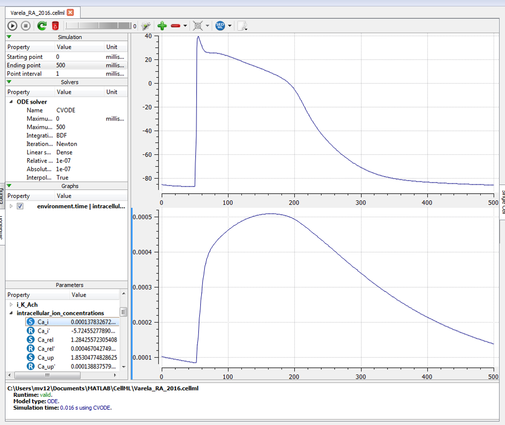

Right atrium model
------------------

This is a CellML encoding of the right atrium variant of the `Varela et al, PLoS Comp Bio, 2016 <http://dx.doi.org/10.1371/journal.pcbi.1005245>`_ canine atrial myocyte model. We also provide a simulation experiment descibed using the `SED-ML <http://sed-ml.org>`_ format: `Varela_RA_2016.sedml <Varela_RA_2016.sedml>`_. If you have `OpenCOR <http://opencor.ws/>`_ installed, selecting the **Launch in OpenCOR** link from the *Views Available* will load this simulation experiment into OpenCOR, where you can execute the simulation and reproduce the results shown below.

   
   A screenshot illustrating the results when launching this model in OpenCOR and executing the simulation experiment.